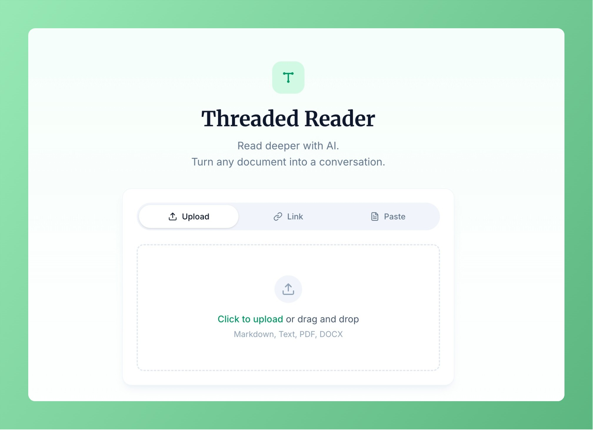
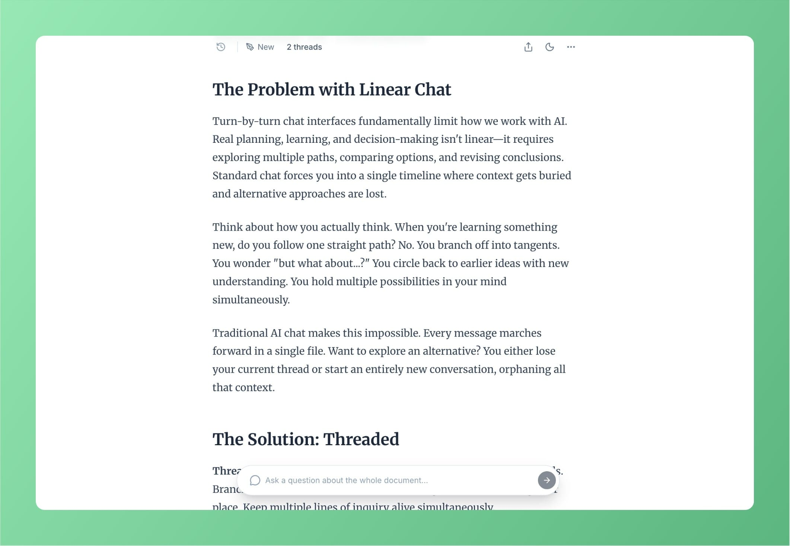
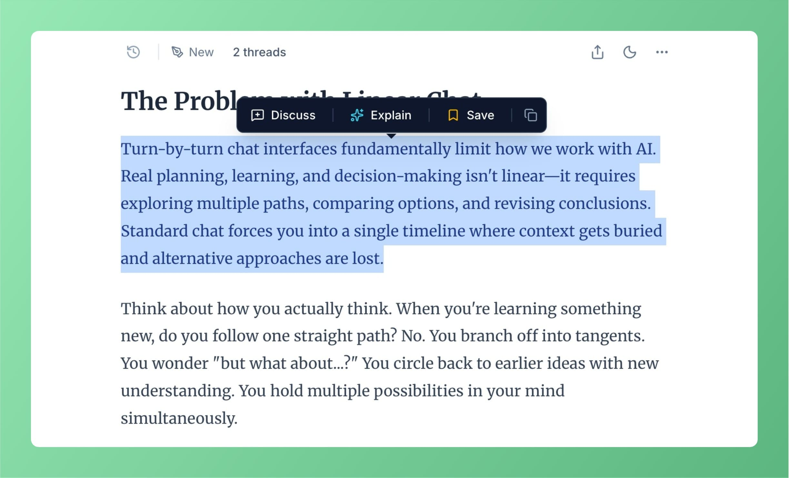
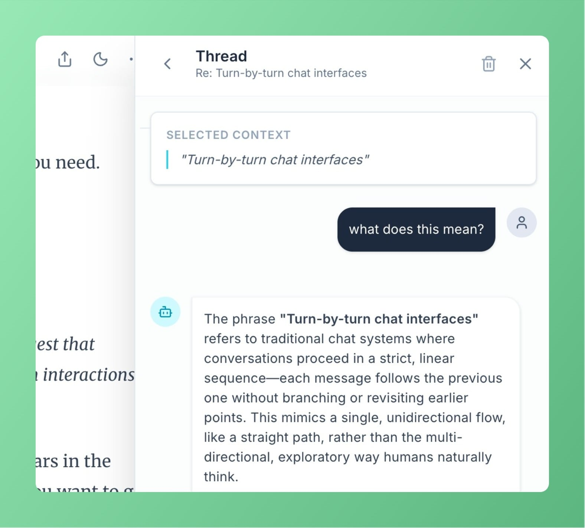
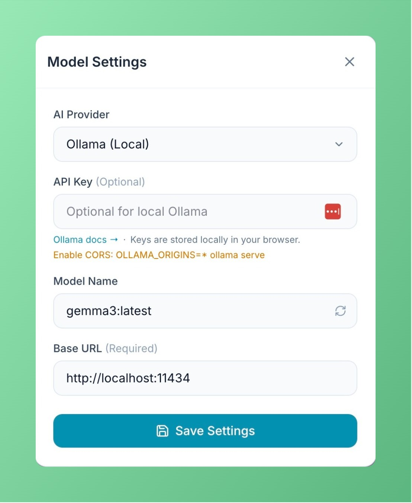

<div align="center">


# Threaded

**A contextual AI powered markdown reader with threads for deep document exploration and AI-assisted learning.**

[](https://react.dev/)
[](https://www.typescriptlang.org/)
[](https://vitejs.dev/)

[Quick Start](#quick-start) · [Usage](#how-to-use) · [Development](#development) · [Architecture](#architecture)

</div>

---

## Table of Contents

- [What is Threaded?](#what-is-threaded)
- [Quick Start](#quick-start)
- [Supported AI Providers](#supported-ai-providers)
- [How to Use](#how-to-use)
- [CLI](#cli)
- [Development](#development)
- [Deployment](#deploy-to-cloudflare-workers)
- [Architecture](#architecture)
- [License](#license)

---

## What is Threaded?

Standard chat interfaces force you into a single, linear timeline. But real thinking isn't linear—it requires exploring tangents, comparing options, and questioning specific details without losing the bigger picture.

Often, samples from an LLM open up more questions which fit in awkwardly with a linear timeline. I find being forced to follow a linear thought path very frustrating so I built Threaded.

Threaded transforms documents into explorable workspaces where you can:

- **Think in branches**: Highlight any text to spin off a focused discussion about that specific idea.
- **Multitask your curiosity**: Keep multiple lines of inquiry open simultaneously, side-by-side with your reading.
- **Bring your own AI**: Use Gemini, OpenAI, Claude, or local Ollama models.
- **Stay private**: AI processing happens in your browser with your keys. Sessions are stored on the server to enable instant sharing, but are accessible *only* via their unguessable 21-character IDs. You can also self-host the entire platform on Cloudflare for complete control.

---

## Quick Start

**Prerequisites:** Node.js 18+, [pnpm](https://pnpm.io/)

```bash
pnpm install
pnpm dev
```

Open [http://localhost:3000](http://localhost:3000) in your browser.

---

## Supported AI Providers

Configure your provider in the Settings modal:

| Provider          | Default Model                    | Notes                          |
| ----------------- | -------------------------------- | ------------------------------ |
| **Google Gemini** | gemini-3-flash-preview           | Default; best cost/perf        |
| **OpenAI**        | gpt-5.2-chat-latest              | Full support for custom bases  |
| **Anthropic**     | claude-opus-4-5-20251101         | High quality, browser-direct   |
| **Ollama**        | qwen3:8b                         | Local inference on port 11434  |

> API keys are stored only in your browser's `localStorage`.

---

## How to Use

1. **Paste markdown content** on the start screen (or use the default example).
2. **Highlight any text** to see the action tooltip:
   - **Discuss** — Start an open-ended conversation about the selection.
   - **Explain** — Get a simplified explanation immediately.
3. **Use the floating input** at the bottom to ask questions about the entire document.
4. **Export** the document with all conversations as markdown.

---

## CLI

Open local files directly from your terminal:

```bash
pnpm install -g @andypai/threaded
threaded ./document.pdf
```

Useful for AI agent workflows—pipe plans or code context into Threaded for deeper analysis.

See [cli/README.md](cli/README.md) for installation options and full documentation.

---

## Development

### Frontend Only

```bash
pnpm dev      # Start Vite dev server at http://localhost:3000
```

### Full Stack (with Cloudflare Worker)

```bash
pnpm dev:full    # Starts both Worker and Vite dev server
```

Or run them separately:

```bash
# Terminal 1: Worker
pnpm dev:cf

# Terminal 2: Vite (proxies /api to Worker)
pnpm dev
```

### CLI Utility

Open local files directly from your terminal:

```bash
pnpm cli -- ./your-document.pdf
```

#### Prerequisites

1. **Cloudflare Authentication** — Run `pnpm wrangler login`.
2. **Local Secrets** — Create `.dev.vars` from the example.
3. **D1 Database Setup** — Create the D1 database and apply the schema:

   ```bash
   pnpm wrangler d1 create threaded-db
   pnpm wrangler d1 execute threaded-db --local --file=migrations/schema.sql
   ```

   Update the `database_id` in both `wrangler.toml` and `wrangler.dev.toml` with the ID returned from the create command.

---

## Deploy to Cloudflare Workers

```bash
pnpm deploy:cf
```

**What happens:**

- `pnpm build` creates the static bundle in `dist/`.
- `wrangler` uploads `dist/` via the `ASSETS` binding and deploys the worker.

---

## Architecture

Threaded is built as a Cloudflare Worker that serves both a React SPA and a JSON API.

### Project Structure

```text
├── App.tsx                  # State hub & view router
├── cli/                     # CLI tool for opening local files
├── components/              # UI components (ThreadPanel, Tooltip, etc.)
├── docs/                    # Architecture documentation
├── examples/                # Example markdown files
├── hooks/                   # React hooks (useSession, useAiRequest)
├── lib/                     # Utilities (API client, formatters)
├── migrations/              # D1 database schema
├── services/                # AI service & content parser
└── worker/                  # Cloudflare Worker backend
    ├── routes/              # API endpoints
    └── utils/               # Parsing & validation
```

### API Endpoints

- `POST /api/parse`: Convert files/URLs to markdown.
- `POST /api/sessions`: Create new shared sessions.
- `GET/DELETE /api/sessions/:id`: Manage session data.
- `POST /api/sessions/:id/threads`: Anchor new conversations.
- `POST /api/sessions/:id/fork`: Clone a session.

---

## Screenshots

### Reading View



### Contextual Tooltip



### Thread Panel



### Settings



---

## License

MIT
